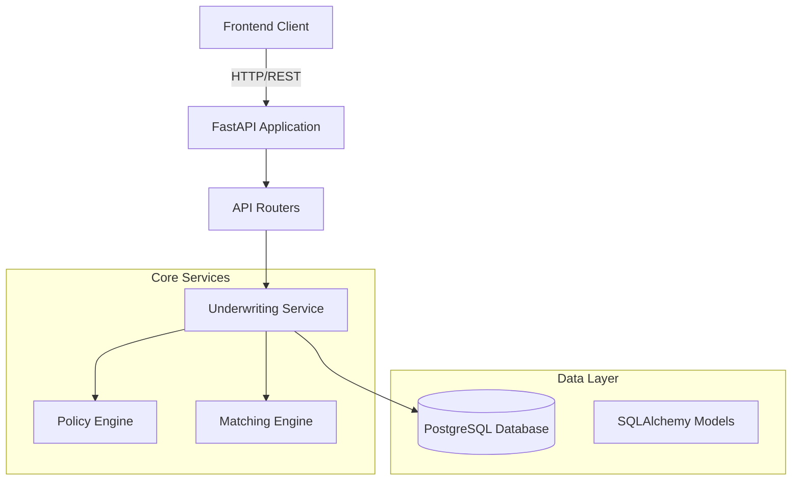
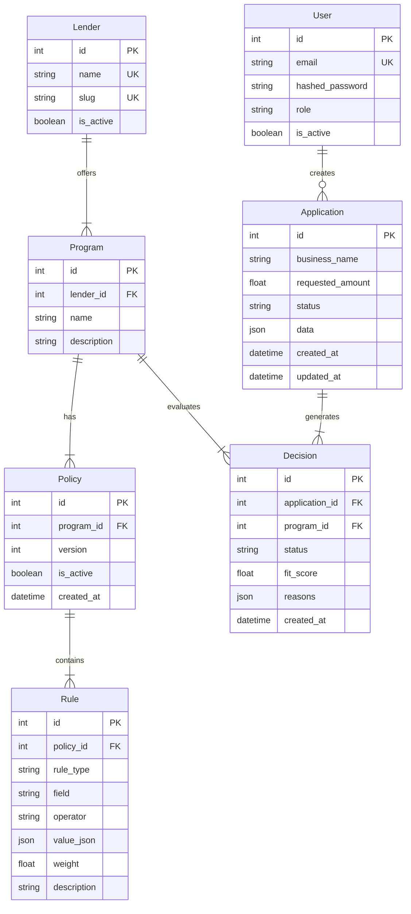
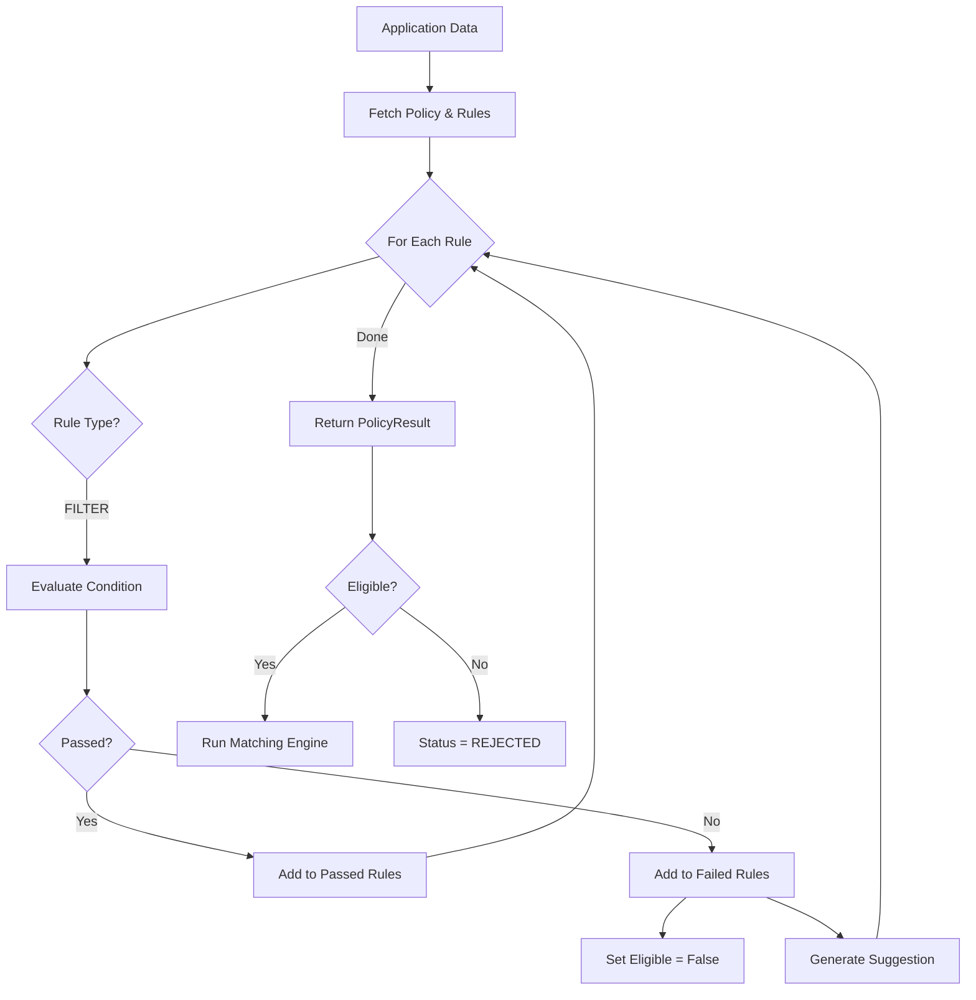
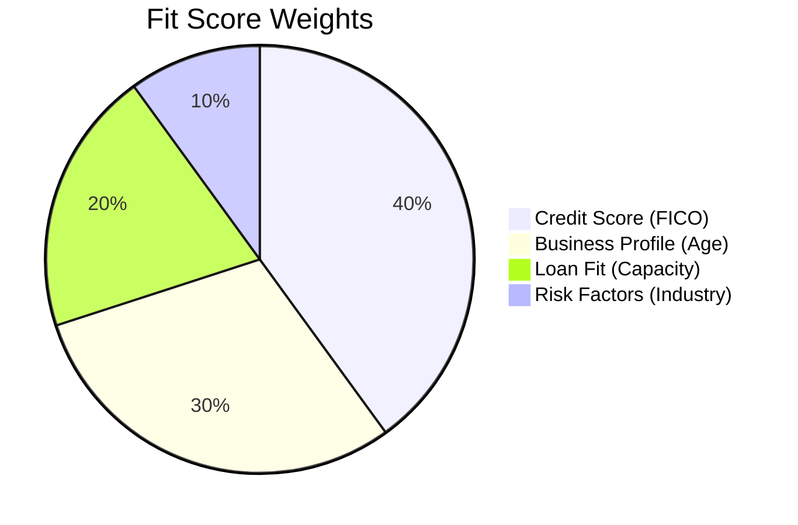
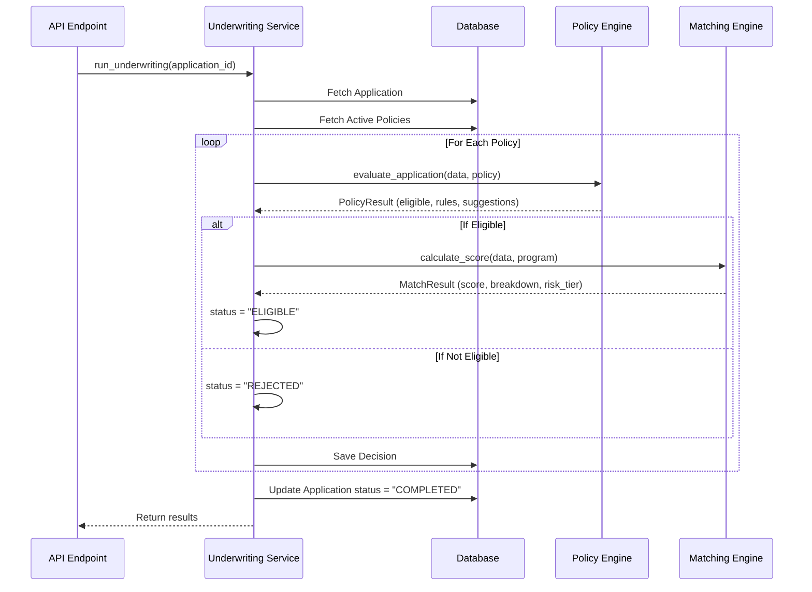

# Backend Logic Deep Dive - Architecture & Design Decisions

## Table of Contents

1. [System Architecture Overview](#system-architecture-overview)
2. [Database Design & Models](#database-design--models)
3. [Policy Engine Logic](#policy-engine-logic)
4. [Matching Engine Algorithm](#matching-engine-algorithm)
5. [Workflow Orchestration](#workflow-orchestration)
6. [Design Decisions & Tradeoffs](#design-decisions--tradeoffs)
7. [Alternative Approaches](#alternative-approaches)

---

## System Architecture Overview

### High-Level Architecture



### Layered Architecture

The backend follows a **clean layered architecture**:

```
┌─────────────────────────────────────┐
│   API Layer (FastAPI Routers)      │  ← HTTP endpoints
├─────────────────────────────────────┤
│   Service Layer (Business Logic)   │  ← Orchestration
├─────────────────────────────────────┤
│   Engine Layer (Core Algorithms)    │  ← Policy & Matching
├─────────────────────────────────────┤
│   Data Layer (SQLAlchemy ORM)      │  ← Database access
└─────────────────────────────────────┘
```

**Why this architecture?**

- ✅ **Separation of Concerns**: Each layer has a single responsibility
- ✅ **Testability**: Engines can be tested independently
- ✅ **Maintainability**: Changes to one layer don't affect others
- ✅ **Scalability**: Services can be extracted to microservices later

---

## Database Design & Models

### Entity Relationship Diagram



### Key Design Decisions

#### 1. **Flexible Application Data (JSON Column)**

**Implementation**: [models.py:80](file:///d:/KAAJ-PROJECT/backend/app/db/models.py#L80)

```python
data = Column(JSON, nullable=False)
```

**Why JSON?**

- ✅ **Flexibility**: Different lenders may require different fields
- ✅ **No Schema Migrations**: Adding new fields doesn't require ALTER TABLE
- ✅ **Forward Compatibility**: New application types don't break existing code

**Tradeoffs**:

- ❌ **No Type Safety**: Can't enforce field types at DB level
- ❌ **Query Performance**: Can't index JSON fields efficiently (in most DBs)
- ❌ **Data Integrity**: No foreign key constraints on nested data

**Alternative Approach**:

```python
# Option 1: Rigid Schema (EAV Pattern)
class ApplicationField(Base):
    application_id = Column(Integer, ForeignKey('applications.id'))
    field_name = Column(String)
    field_value = Column(String)

# Option 2: Separate Tables
class BusinessProfile(Base):
    application_id = Column(Integer, ForeignKey('applications.id'))
    fico = Column(Integer)
    years_in_business = Column(Float)
    annual_revenue = Column(Float)
```

**Why we chose JSON**:

- This is a **lender matching platform**, not a traditional loan origination system
- Requirements change frequently as new lenders join
- Query performance is less critical than flexibility (we're not doing complex analytics on application data)

---

#### 2. **Policy-Rule Separation**

**Implementation**: [models.py:41-69](file:///d:/KAAJ-PROJECT/backend/app/db/models.py#L41-L69)

```
Policy (1) ──────> (N) Rules
```

**Why separate?**

- ✅ **Versioning**: Can create new policy versions without duplicating rules
- ✅ **Composability**: Rules can be reused across policies
- ✅ **Auditability**: Track which rules changed between versions

**How it works**:

```python
class Policy(Base):
    version = Column(Integer, default=1)
    is_active = Column(Boolean, default=True)
    rules = relationship("Rule", cascade="all, delete-orphan")
```

**Cascade Delete**: When a policy is deleted, all its rules are automatically deleted. This prevents orphaned rules.

---

#### 3. **Rule Type Enum: FILTER vs SCORING**

**Implementation**: [models.py:53-55](file:///d:/KAAJ-PROJECT/backend/app/db/models.py#L53-L55)

```python
class RuleType(str, enum.Enum):
    FILTER = "filter"    # Hard Knockout
    SCORING = "scoring"  # Adds to score
```

**Why two types?**

| Type        | Purpose            | Example                     | Behavior               |
| ----------- | ------------------ | --------------------------- | ---------------------- |
| **FILTER**  | Hard requirements  | `fico >= 600`               | If fails → REJECTED    |
| **SCORING** | Preference scoring | `fico > 700 adds 10 points` | If fails → Lower score |

**Current Implementation**: Only `FILTER` rules are used. `SCORING` rules are reserved for future enhancement.

**Tradeoff**:

- ✅ **Future-proof**: Can add scoring logic without schema changes
- ❌ **Unused Code**: SCORING type exists but isn't implemented yet

---

#### 4. **Decision Storage (JSON Reasons)**

**Implementation**: [models.py:95](file:///d:/KAAJ-PROJECT/backend/app/db/models.py#L95)

```python
reasons = Column(JSON, nullable=True)
# Stores: { "passed": [...], "failed": [...], "suggestions": [...] }
```

**Why JSON for reasons?**

- ✅ **Rich Explanations**: Can store complex nested data (rule details, suggestions)
- ✅ **Explainable AI**: Frontend can display detailed rejection reasons
- ✅ **Audit Trail**: Complete record of why a decision was made

**Structure**:

```json
{
  "passed": [
    {
      "rule_id": 1,
      "rule_description": "FICO Check",
      "passed": true,
      "reason": "..."
    }
  ],
  "failed": [
    {
      "rule_id": 2,
      "rule_description": "Revenue Check",
      "passed": false,
      "reason": "..."
    }
  ],
  "suggestions": ["Increase Annual Revenue to $500,000"],
  "risk_tier": "B"
}
```

---

## Policy Engine Logic

### Core Evaluation Flow



### Implementation Details

**File**: [policy_engine.py](file:///d:/KAAJ-PROJECT/backend/app/services/policy_engine.py)

#### 1. **Operator Mapping**

**Implementation**: [policy_engine.py:20-29](file:///d:/KAAJ-PROJECT/backend/app/services/policy_engine.py#L20-L29)

```python
OPS = {
    ">": operator.gt,
    ">=": operator.ge,
    "<": operator.lt,
    "<=": operator.le,
    "==": operator.eq,
    "!=": operator.ne,
    "in": lambda x, y: x in y,
    "not in": lambda x, y: x not in y,
}
```

**Why this approach?**

- ✅ **Security**: Using Python's `operator` module prevents code injection
- ✅ **Type Safety**: Operators work with any comparable types
- ✅ **Extensibility**: Easy to add new operators

**Security Consideration**:

```python
# ❌ DANGEROUS - Never do this!
eval(f"{field_value} {operator} {target_value}")

# ✅ SAFE - Use operator mapping
op_func = OPS.get(operator)
op_func(field_value, target_value)
```

---

#### 2. **Missing Field Handling**

**Implementation**: [policy_engine.py:45-48](file:///d:/KAAJ-PROJECT/backend/app/services/policy_engine.py#L45-L48)

```python
if field_value is None:
    passed = False
    reason = f"Data for '{rule.field.replace('_', ' ').title()}' was not provided."
```

**Design Decision**: **Fail-Safe by Default**

**Why fail if field is missing?**

- ✅ **Conservative Approach**: Better to reject than approve incorrectly
- ✅ **Data Quality**: Encourages complete applications
- ✅ **Transparency**: User knows exactly what's missing

**Alternative Approach**:

```python
# Option 1: Skip missing fields
if field_value is None:
    continue  # Ignore this rule

# Option 2: Default values
if field_value is None:
    field_value = 0  # Assume worst case
```

**Why we chose fail-safe**:

- Lending decisions require complete information
- Missing data could hide risk factors
- Better UX to tell user what's missing upfront

---

#### 3. **Explainable AI - Human-Readable Reasons**

**Implementation**: [policy_engine.py:107-126](file:///d:/KAAJ-PROJECT/backend/app/services/policy_engine.py#L107-L126)

```python
def _generate_explanation(self, field: str, actual: Any, operator: str, target: Any) -> str:
    field_readable = field.replace("_", " ").title()

    if operator == ">=":
        return f"The {field_readable} of {actual} is too low. A minimum of {target} is required."
    elif operator == "in":
        return f"The {field_readable} '{actual}' is not in the allowed list: {target}."
    # ... more cases
```

**Why template-based explanations?**

- ✅ **User-Friendly**: Non-technical users understand why they were rejected
- ✅ **Regulatory Compliance**: Adverse action notices require explanations
- ✅ **Actionable**: Users know what to improve

**Example Output**:

```
❌ The FICO Score of 580 is too low. A minimum of 600 is required.
✅ Checked fico: 720 is >= 600.
```

---

#### 4. **Smart Suggestions**

**Implementation**: [policy_engine.py:86-94](file:///d:/KAAJ-PROJECT/backend/app/services/policy_engine.py#L86-L94)

```python
def _generate_suggestion(self, field: str, operator: str, target: Any) -> str:
    if field == "fico":
        return f"Increase FICO score to at least {target}."
    if field == "annual_revenue":
        return f"Increase Annual Revenue to ${target}."
    # ...
```

**Why field-specific suggestions?**

- ✅ **Actionable Feedback**: Users know exactly what to improve
- ✅ **Better UX**: Reduces frustration from rejections
- ✅ **Conversion**: Helps marginal applicants become eligible

**Tradeoff**:

- ❌ **Hardcoded Logic**: Adding new fields requires code changes
- ❌ **Limited Intelligence**: Doesn't consider multiple factors

**Future Enhancement**:

```python
# AI-powered suggestions
def generate_ai_suggestion(failed_rules, application_data):
    prompt = f"User failed these rules: {failed_rules}. Suggest improvements."
    return llm.generate(prompt)
```

---

## Matching Engine Algorithm

### Scoring Breakdown

**File**: [matching_engine.py](file:///d:/KAAJ-PROJECT/backend/app/services/matching_engine.py)

The matching engine calculates a **0-100 fit score** based on 4 weighted factors:



### 1. **Credit Score Component (40%)**

**Implementation**: [matching_engine.py:18-24](file:///d:/KAAJ-PROJECT/backend/app/services/matching_engine.py#L18-L24)

```python
# Normalize FICO (300-850) to 0-40 points
# Baseline: 600 = 0 points, 800+ = 40 points
fico = application_data.get('fico', 0)
fico_score = min(40, max(0, (fico - 600) * 0.2))
```

**Formula**: `score = min(40, max(0, (fico - 600) * 0.2))`

**Score Table**:
| FICO | Calculation | Score |
|------|-------------|-------|
| 300 | (300-600)*0.2 = -60 → 0 | 0 |
| 600 | (600-600)*0.2 = 0 | 0 |
| 700 | (700-600)*0.2 = 20 | 20 |
| 800 | (800-600)*0.2 = 40 | 40 |
| 850 | (850-600)\*0.2 = 50 → 40 | 40 |

**Why this formula?**

- ✅ **Industry Standard**: 600 is typical minimum for business loans
- ✅ **Linear Scaling**: Simple and predictable
- ✅ **Capped**: Prevents outliers from dominating score

**Tradeoff**:

- ❌ **Arbitrary Baseline**: Why 600? Could be 650 or 580
- ❌ **Linear Assumption**: Real risk isn't linear with FICO

**Alternative Approaches**:

```python
# Option 1: Exponential scaling (rewards high scores more)
fico_score = 40 * ((fico - 300) / 550) ** 2

# Option 2: Tiered scoring
if fico >= 750: fico_score = 40
elif fico >= 700: fico_score = 30
elif fico >= 650: fico_score = 20
# ...

# Option 3: Use actual default probability curves
default_prob = lookup_default_probability(fico)
fico_score = 40 * (1 - default_prob)
```

---

### 2. **Business Profile Component (30%)**

**Implementation**: [matching_engine.py:26-31](file:///d:/KAAJ-PROJECT/backend/app/services/matching_engine.py#L26-L31)

```python
# Years in business: 1 year = 5 points, cap at 6 years = 30 points
years = application_data.get('years_in_business', 0)
age_score = min(30, years * 5)
```

**Formula**: `score = min(30, years * 5)`

**Score Table**:
| Years | Calculation | Score |
|-------|-------------|-------|
| 0 | 0 _ 5 = 0 | 0 |
| 1 | 1 _ 5 = 5 | 5 |
| 3 | 3 _ 5 = 15 | 15 |
| 6 | 6 _ 5 = 30 | 30 |
| 10 | 10 \* 5 = 50 → 30 | 30 |

**Why cap at 6 years?**

- ✅ **Diminishing Returns**: After 6 years, age matters less
- ✅ **Prevents Dominance**: Old businesses don't automatically win

**Tradeoff**:

- ❌ **Ignores Industry**: Restaurant vs Tech have different survival curves
- ❌ **Linear Assumption**: Risk doesn't decrease linearly with age

---

### 3. **Loan Fit Component (20%)**

**Implementation**: [matching_engine.py:33-52](file:///d:/KAAJ-PROJECT/backend/app/services/matching_engine.py#L33-L52)

```python
# Ratio of Amount to Annual Revenue
revenue = application_data.get('annual_revenue', 1) or 1
amount = application_data.get('requested_amount', 0)
ratio = amount / revenue if revenue > 0 else 1.0

if ratio <= 0.10:
    loan_score = 20  # Excellent capacity
elif ratio <= 0.25:
    loan_score = 15  # Good
elif ratio <= 0.50:
    loan_score = 10  # Moderate risk
else:
    loan_score = 5   # High leverage
```

**Why use debt-to-revenue ratio?**

- ✅ **Capacity Indicator**: Shows ability to repay
- ✅ **Industry Standard**: Common metric in lending
- ✅ **Risk Proxy**: High leverage = higher default risk

**Score Table**:
| Ratio | Interpretation | Score |
|-------|----------------|-------|
| ≤ 10% | Conservative, low risk | 20 |
| ≤ 25% | Reasonable, moderate risk | 15 |
| ≤ 50% | Aggressive, higher risk | 10 |
| > 50% | Very high leverage | 5 |

**Example**:

- Revenue: $1,000,000
- Requested: $100,000
- Ratio: 10% → Score: 20 ✅

**Tradeoff**:

- ❌ **Ignores Cash Flow**: Revenue ≠ profit
- ❌ **Ignores Existing Debt**: Doesn't consider current liabilities

**Better Approach**:

```python
# Debt Service Coverage Ratio (DSCR)
monthly_payment = calculate_payment(amount, rate, term)
monthly_income = (revenue - expenses) / 12
dscr = monthly_income / monthly_payment

if dscr >= 1.5: loan_score = 20  # Strong coverage
elif dscr >= 1.25: loan_score = 15
# ...
```

---

### 4. **Risk Factors Component (10%)**

**Implementation**: [matching_engine.py:54-62](file:///d:/KAAJ-PROJECT/backend/app/services/matching_engine.py#L54-L62)

```python
industry = application_data.get('industry', 'General')
risk_score = 10

if industry in ["Retail", "Restaurant"]:
    risk_score = 5  # Higher volatility
```

**Why penalize certain industries?**

- ✅ **Historical Data**: Retail/Restaurant have higher failure rates
- ✅ **COVID Impact**: These industries were hit hardest
- ✅ **Risk Adjustment**: Reflects real-world default probabilities

**Tradeoff**:

- ❌ **Oversimplified**: All restaurants aren't equally risky
- ❌ **Bias**: Could discriminate against certain businesses
- ❌ **Static**: Doesn't adapt to market conditions

**Better Approach**:

```python
# Industry-specific risk scores from data
INDUSTRY_RISK = {
    "Technology": 8,
    "Healthcare": 9,
    "Restaurant": 4,
    "Retail": 5,
    # ... based on actual default rates
}
risk_score = INDUSTRY_RISK.get(industry, 7)  # Default to moderate
```

---

### 5. **Risk Tier Calculation**

**Implementation**: [matching_engine.py:66-71](file:///d:/KAAJ-PROJECT/backend/app/services/matching_engine.py#L66-L71)

```python
risk_tier = "C"  # High Risk
if final_score >= 80:
    risk_tier = "A"  # Low Risk
elif final_score >= 50:
    risk_tier = "B"  # Medium Risk
```

**Tier Breakdown**:
| Tier | Score Range | Interpretation |
|------|-------------|----------------|
| A | 80-100 | Low Risk, Prime |
| B | 50-79 | Medium Risk, Near-Prime |
| C | 0-49 | High Risk, Subprime |

**Why 3 tiers?**

- ✅ **Simplicity**: Easy to understand and communicate
- ✅ **Actionable**: Different tiers → different terms/rates
- ✅ **Industry Standard**: Similar to credit grades

**Tradeoff**:

- ❌ **Arbitrary Cutoffs**: Why 80 and 50? Could be 75 and 55
- ❌ **Cliff Effect**: Score of 79 vs 80 has big difference

---

## Workflow Orchestration

### Underwriting Service Flow

**File**: [workflow.py](file:///d:/KAAJ-PROJECT/backend/app/services/workflow.py)



### Key Design Decisions

#### 1. **Synchronous vs Asynchronous Processing**

**Current Implementation**: [workflow.py:26-28](file:///d:/KAAJ-PROJECT/backend/app/services/workflow.py#L26-L28)

```python
# Run synchronously for MVP/Demo purposes
service = UnderwritingService(db)
results = service.run_underwriting(application_id)
```

**Why synchronous?**

- ✅ **Simplicity**: Easier to debug and test
- ✅ **Immediate Results**: User sees results instantly
- ✅ **No Queue Infrastructure**: No need for Celery/Redis

**Tradeoffs**:

- ❌ **Blocks Request**: Long-running evaluations block the API
- ❌ **No Scalability**: Can't handle high volume
- ❌ **Timeout Risk**: May exceed HTTP timeout limits

**Production Approach**:

```python
# Option 1: Background Tasks (FastAPI built-in)
background_tasks.add_task(service.run_underwriting, application_id)
return {"status": "Processing", "job_id": job_id}

# Option 2: Celery Task Queue
@celery_app.task
def run_underwriting_async(application_id):
    service = UnderwritingService(db)
    return service.run_underwriting(application_id)

# Option 3: Event-Driven (Kafka/RabbitMQ)
producer.send('underwriting.requests', application_id)
```

**When to switch?**

- If processing takes > 5 seconds
- If handling > 100 applications/minute
- If need retry logic for failures

---

#### 2. **Evaluate All Policies vs Stop on First Match**

**Current Implementation**: [workflow.py:27](file:///d:/KAAJ-PROJECT/backend/app/services/workflow.py#L27)

```python
# Evaluate EVERY active policy
for policy in policies:
    policy_result = self.policy_engine.evaluate_application(eval_data, policy)
    # ... save decision
```

**Why evaluate all?**

- ✅ **Maximum Options**: User sees all possible lenders
- ✅ **Comparison Shopping**: Can compare terms across lenders
- ✅ **Better Matches**: Might find better fit in later policies

**Tradeoffs**:

- ❌ **Performance**: More policies = longer processing time
- ❌ **Wasted Work**: If user only needs one approval

**Alternative Approaches**:

```python
# Option 1: Stop on first approval
for policy in policies:
    result = evaluate(policy)
    if result.eligible:
        return result  # Stop here

# Option 2: Prioritized evaluation
policies = sorted(policies, key=lambda p: p.priority)
for policy in policies[:5]:  # Only top 5
    evaluate(policy)

# Option 3: Parallel evaluation
with ThreadPoolExecutor() as executor:
    futures = [executor.submit(evaluate, p) for p in policies]
    results = [f.result() for f in futures]
```

---

#### 3. **Data Merging Strategy**

**Implementation**: [workflow.py:28-31](file:///d:/KAAJ-PROJECT/backend/app/services/workflow.py#L28-L31)

```python
# Merge top-level fields with flexible data
eval_data = application.data.copy()
eval_data["requested_amount"] = application.requested_amount
eval_data["business_name"] = application.business_name
```

**Why merge?**

- ✅ **Unified View**: Engines see all data in one dict
- ✅ **Flexibility**: Can reference any field in rules
- ✅ **Backward Compatibility**: Works with existing rules

**Tradeoff**:

- ❌ **Name Collisions**: What if `data` already has `requested_amount`?
- ❌ **Implicit Contract**: Engines must know which fields exist

**Better Approach**:

```python
# Option 1: Namespaced data
eval_data = {
    "application": {
        "requested_amount": application.requested_amount,
        "business_name": application.business_name
    },
    "business": application.data
}

# Option 2: Explicit mapping
eval_data = ApplicationDataMapper.to_evaluation_format(application)
```

---

## Design Decisions & Tradeoffs

### 1. **Rule Storage: JSON vs Separate Tables**

**Current**: Rules stored in database with JSON `value_json` column

**Pros**:

- ✅ Flexible: Can store any value type (number, string, array)
- ✅ Simple: One table for all rule types
- ✅ Easy to version: Just copy rows

**Cons**:

- ❌ No type safety at DB level
- ❌ Can't index on rule values
- ❌ Harder to query (e.g., "find all rules with FICO > 700")

**Alternative**: Strongly-typed rule tables

```python
class NumericRule(Base):
    field = Column(String)
    operator = Column(String)
    value = Column(Float)  # Typed!

class ListRule(Base):
    field = Column(String)
    operator = Column(String)
    values = relationship("RuleValue")  # Separate table
```

**Why we chose JSON**: Flexibility > Type Safety for this use case

---

### 2. **Scoring Algorithm: Hardcoded vs ML Model**

**Current**: Hardcoded weights and formulas in `matching_engine.py`

**Pros**:

- ✅ Transparent: Anyone can understand the logic
- ✅ Predictable: Same inputs = same outputs
- ✅ Debuggable: Easy to trace why a score was calculated
- ✅ No Training Data Needed: Works from day one

**Cons**:

- ❌ Not Adaptive: Doesn't learn from outcomes
- ❌ Arbitrary Weights: Why 40% for FICO? Why not 35%?
- ❌ Ignores Interactions: Doesn't consider FICO + Revenue together

**ML Alternative**:

```python
# Train on historical data
model = train_default_prediction_model(historical_loans)

# Use in production
risk_score = model.predict_proba(application_data)[1]
fit_score = 100 * (1 - risk_score)
```

**Why we chose hardcoded**:

- No historical data available yet
- Need explainability for regulatory compliance
- Easier to iterate and adjust weights
- Can switch to ML later once we have data

---

### 3. **Policy Versioning: Soft Delete vs Hard Versioning**

**Current**: Soft delete with `is_active` flag

**Implementation**: [models.py:47](file:///d:/KAAJ-PROJECT/backend/app/db/models.py#L47)

```python
is_active = Column(Boolean, default=True)
```

**Pros**:

- ✅ Simple: Just flip a flag
- ✅ Reversible: Can reactivate old policies
- ✅ Audit Trail: All versions remain in DB

**Cons**:

- ❌ Cluttered DB: Old policies never deleted
- ❌ Query Complexity: Must always filter `is_active=True`
- ❌ No Diff: Can't easily see what changed between versions

**Alternative**: Hard versioning

```python
class Policy(Base):
    version = Column(Integer)
    parent_policy_id = Column(Integer, ForeignKey('policies.id'))

# Query latest version
latest = db.query(Policy).filter(
    Policy.program_id == program_id,
    Policy.parent_policy_id == None
).order_by(Policy.version.desc()).first()
```

**Why we chose soft delete**: Simplicity for MVP

---

### 4. **Error Handling: Fail Fast vs Graceful Degradation**

**Current**: Fail fast approach

**Example**: [policy_engine.py:45-48](file:///d:/KAAJ-PROJECT/backend/app/services/policy_engine.py#L45-L48)

```python
if field_value is None:
    passed = False  # Fail immediately
```

**Pros**:

- ✅ Conservative: Won't approve bad applications
- ✅ Clear Feedback: User knows what's missing
- ✅ Data Quality: Encourages complete applications

**Cons**:

- ❌ Strict: Might reject good applications with minor missing data
- ❌ Poor UX: User might abandon if too many required fields

**Alternative**: Graceful degradation

```python
if field_value is None:
    # Use default or skip rule
    field_value = get_default_value(field)
    warnings.append(f"Missing {field}, using default")
```

**Why we chose fail fast**: Lending requires complete information

---

### 5. **API Design: REST vs GraphQL**

**Current**: RESTful API with FastAPI

**Pros**:

- ✅ Simple: Standard HTTP methods
- ✅ Cacheable: Can use HTTP caching
- ✅ Well-understood: Most developers know REST
- ✅ Auto-docs: FastAPI generates OpenAPI/Swagger

**Cons**:

- ❌ Over-fetching: Returns all fields even if not needed
- ❌ Under-fetching: Might need multiple requests
- ❌ Rigid: Can't customize response structure

**GraphQL Alternative**:

```graphql
query {
  application(id: 123) {
    businessName
    decisions {
      status
      fitScore
      program {
        name
        lender {
          name
        }
      }
    }
  }
}
```

**Why we chose REST**: Simpler for MVP, can add GraphQL layer later

---

## Alternative Approaches

### 1. **Rules Engine: Custom vs Existing Library**

**Current**: Custom implementation in `policy_engine.py`

**Alternatives**:

#### Option A: Use `python-rules` library

```python
from rules import Rule, RuleSet

ruleset = RuleSet()
ruleset.add_rule(Rule('fico >= 600', lambda app: app.fico >= 600))
ruleset.add_rule(Rule('revenue > 100000', lambda app: app.revenue > 100000))

result = ruleset.evaluate(application)
```

**Pros**: Battle-tested, more features
**Cons**: Less control, learning curve

#### Option B: Use Drools (Java-based)

```java
rule "FICO Check"
when
    Application(fico < 600)
then
    reject("FICO too low");
end
```

**Pros**: Industry standard, very powerful
**Cons**: Java dependency, complex setup

**Why we built custom**: Full control, Python-native, simpler for our needs

---

### 2. **Scoring: Rule-Based vs ML vs Hybrid**

#### Current: Rule-Based

```python
score = fico_score + age_score + loan_score + risk_score
```

#### Option A: Pure ML

```python
from sklearn.ensemble import RandomForestClassifier

model = RandomForestClassifier()
model.fit(X_train, y_train)
score = model.predict_proba(application_features)[1] * 100
```

**Pros**: Learns patterns, adapts over time
**Cons**: Black box, needs training data

#### Option B: Hybrid

```python
# ML for complex patterns
ml_score = model.predict_proba(features)[1] * 60

# Rules for business constraints
rule_score = 40 if fico >= 600 else 0

final_score = ml_score + rule_score
```

**Pros**: Best of both worlds
**Cons**: More complex to maintain

**Future Direction**: Start with rules, add ML as data accumulates

---

### 3. **Data Storage: SQL vs NoSQL vs Hybrid**

**Current**: PostgreSQL (SQL)

**Alternatives**:

#### Option A: MongoDB (NoSQL)

```javascript
{
  _id: ObjectId("..."),
  business_name: "Acme Corp",
  data: {
    fico: 720,
    revenue: 500000,
    // ... any fields
  },
  decisions: [
    { program_id: 1, status: "ELIGIBLE", score: 85 }
  ]
}
```

**Pros**: Natural fit for flexible schema
**Cons**: Weaker consistency, no joins

#### Option B: Hybrid (SQL + Redis)

```python
# SQL for structured data
application = db.query(Application).get(id)

# Redis for caching/sessions
cache.set(f"app:{id}", application, ttl=3600)
```

**Pros**: Best performance
**Cons**: More infrastructure

**Why we chose PostgreSQL**: ACID guarantees, relationships, JSON support

---

## Summary: Why These Choices?

| Decision             | Choice       | Reason                                |
| -------------------- | ------------ | ------------------------------------- |
| **Architecture**     | Layered      | Separation of concerns, testability   |
| **Database**         | PostgreSQL   | ACID, relationships, JSON support     |
| **Application Data** | JSON column  | Flexibility for changing requirements |
| **Rules Storage**    | Database     | Versioning, auditability              |
| **Scoring**          | Hardcoded    | Transparency, no training data needed |
| **Processing**       | Synchronous  | Simplicity for MVP                    |
| **Evaluation**       | All policies | Maximum options for user              |
| **Error Handling**   | Fail fast    | Conservative, data quality            |
| **API**              | REST         | Simplicity, auto-docs                 |

### Evolution Path

```
MVP (Current)          →  Phase 2              →  Phase 3
─────────────────────────────────────────────────────────────
Hardcoded scoring      →  ML-assisted          →  Full ML
Synchronous            →  Background tasks     →  Event-driven
Single DB              →  DB + Cache           →  Microservices
REST only              →  REST + GraphQL       →  gRPC + GraphQL
Manual rules           →  Rule builder UI      →  Auto-generated rules
```

---

## Conclusion

The backend is designed with **pragmatic tradeoffs** for an MVP:

- **Flexibility** over type safety (JSON columns)
- **Simplicity** over scalability (synchronous processing)
- **Transparency** over accuracy (hardcoded scoring)
- **Speed** over perfection (fail fast validation)

These choices enable **rapid iteration** while maintaining a **clear path to production-grade** architecture.
